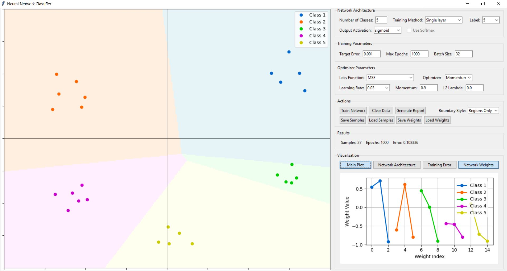
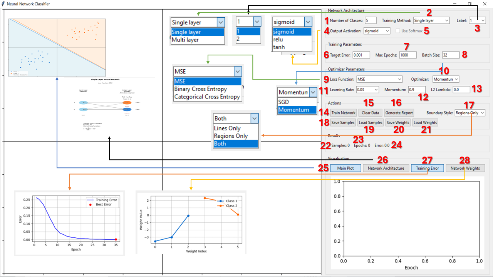
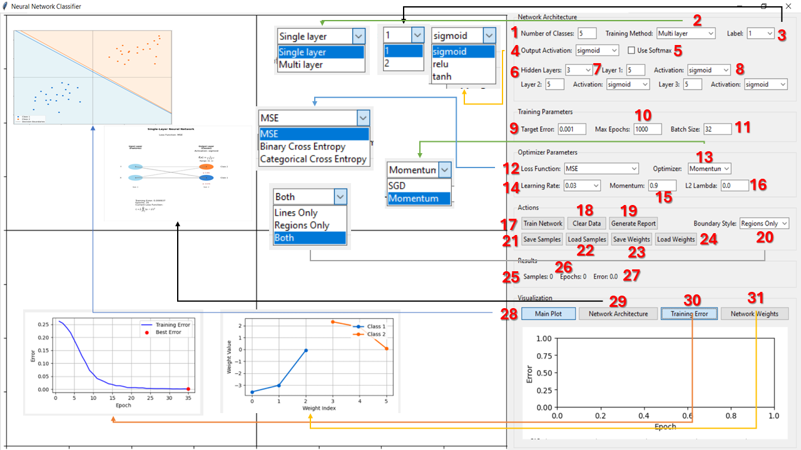
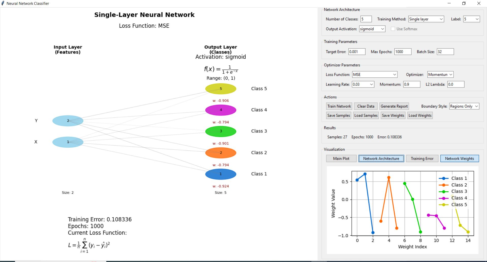
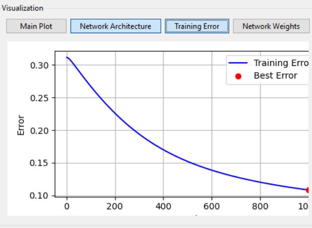
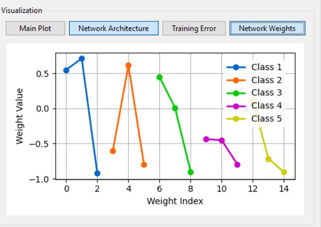
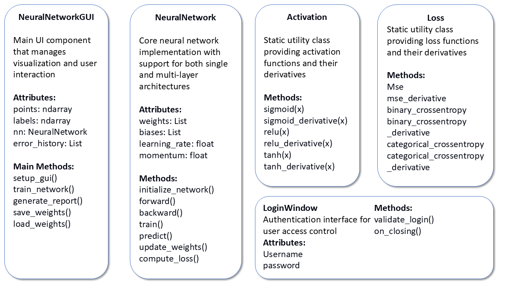

# neural-network-from-scratch

Neural network framework built from scratch in pure NumPy, with an interactive Tkinter GUI for 2D classification tasks.



## Why this exists

An educational tool for visualizing how neural networks learn. Users can place training points, configure network architectures (layers, activations, loss functions), and watch decision boundaries form in real time as the network trains — seeing the effect of changing hyperparameters like learning rate, momentum, regularization, and batch size without writing any code. Everything under the hood is implemented from scratch in NumPy: forward pass, backpropagation, weight updates. No PyTorch, no TensorFlow.

## Features

- **Single-layer and multi-layer networks** (1–3 hidden layers)
- **Activation functions:** sigmoid, ReLU, tanh, softmax
- **Loss functions:** MSE, binary cross-entropy, categorical cross-entropy
- **Optimizers:** SGD and momentum
- **L2 regularization** with configurable lambda
- **Mini-batch training** with adaptive learning rate and early stopping
- **Interactive GUI:**
  - Click to place training points for up to 100 classes
  - Real-time decision boundary visualization (regions, lines, or both)
  - Live architecture diagram with weights, activations, and loss equations
  - Training error and weight distribution plots
  - Save/load samples and trained weights (.npz)
  - PDF report generation with all charts and parameters

## GUI Overview

**Single-layer mode** — all controls numbered for reference:



**Multi-layer mode** — adds hidden layer configuration (layers, sizes, activations):



## Screenshots

| Network Architecture | Training Error | Network Weights |
|:---:|:---:|:---:|
|  |  |  |

## Download

A standalone `.exe` is available — no Python installation needed:

**[Neural Network Classifier.exe](https://github.com/YOUR_USERNAME/neural-network-from-scratch/releases/latest)**

> Download the latest release from the **Releases** page.

## Quick Start

### Option 1: Preview mode (no login)

```bash
pip install -r requirements.txt
python preview.py
```

### Option 2: Admin mode (with login)

```bash
pip install -r requirements.txt
python main.py
```

1. Log in with the credentials shown on launch
2. Set the number of classes and select a label
2. Click on the plot to place training samples
3. Configure network architecture and training parameters
4. Click **Train Network**
5. Switch between Main Plot, Architecture, Error, and Weights views

## How it works

**Forward pass** — input is multiplied by weight matrices and passed through activation functions layer by layer. For multi-class output, softmax converts raw scores to probabilities.

**Loss** — the network computes how far predictions are from targets using MSE, binary cross-entropy, or categorical cross-entropy.

**Backpropagation** — gradients of the loss with respect to each weight are computed by applying the chain rule backwards through the network.

**Weight update** — weights are adjusted by subtracting the gradient scaled by the learning rate. With momentum, a velocity term accumulates past gradients to smooth updates and escape local minima.

## Class Diagram



## Project Structure

```
neural-network-from-scratch/
├── main.py              # Entry point (admin, with login)
├── preview.py           # Entry point (preview, no login)
├── activations.py       # Activation functions and derivatives
├── losses.py            # Loss functions and derivatives
├── network.py           # NeuralNetwork class (training engine)
├── gui/
│   ├── __init__.py      # Package exports
│   ├── app.py           # Main GUI (layout, controls, event handling)
│   ├── login.py         # Login window
│   ├── visualization.py # Decision boundaries, architecture, plots
│   └── report.py        # PDF report generation
├── requirements.txt
├── LICENSE
└── README.md
```

## Requirements

- Python 3.9+
- NumPy
- Matplotlib
- Pillow
- ReportLab
- Tkinter (included with most Python installations)

## Limitations

- Input is fixed to 2D (x, y coordinates) — designed for visual classification demos
- Training runs on the main thread, so the GUI freezes during long training runs
- No GPU acceleration — all computation is CPU-based via NumPy
- Maximum of 3 hidden layers

## License

MIT — see [LICENSE](LICENSE).
